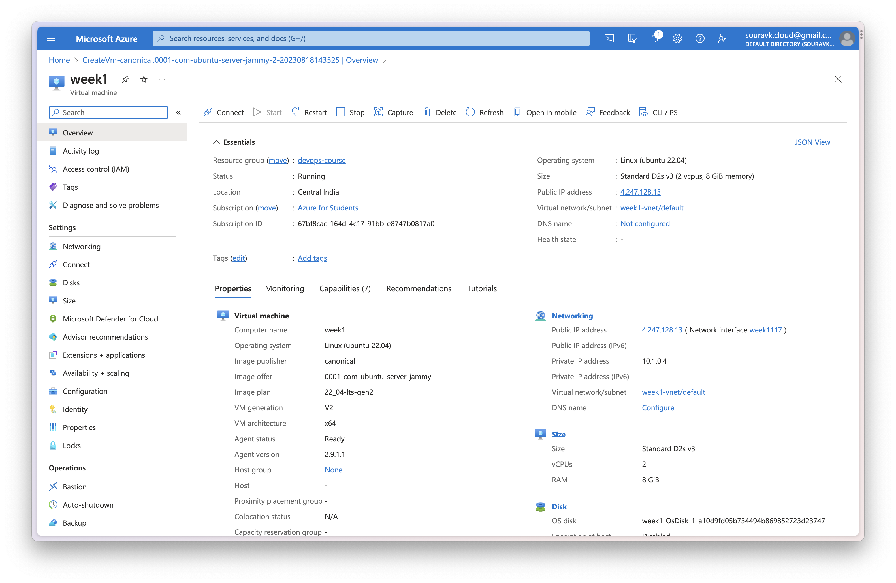
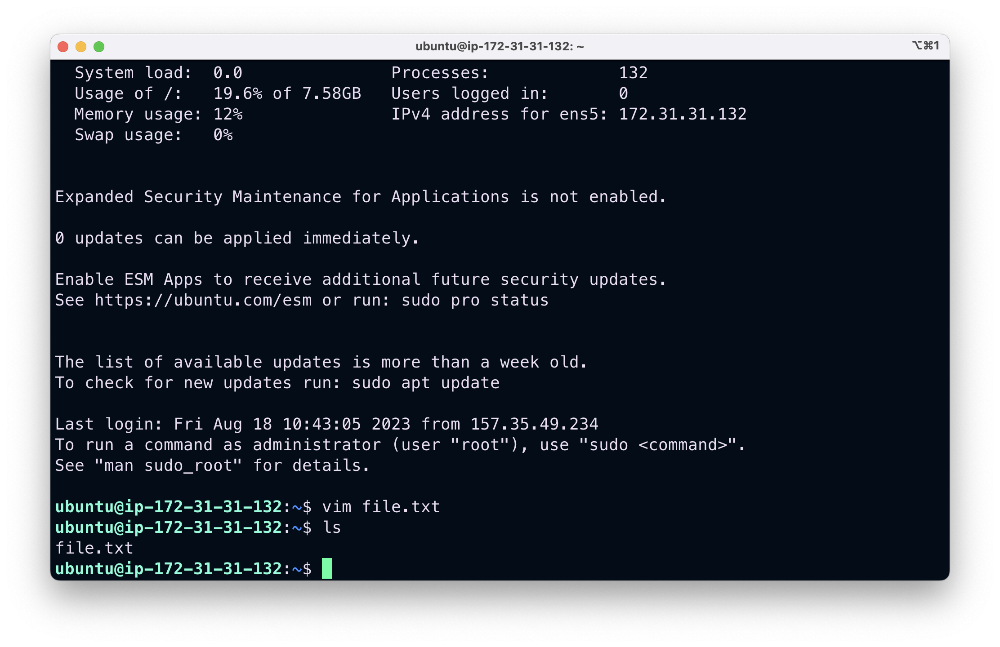
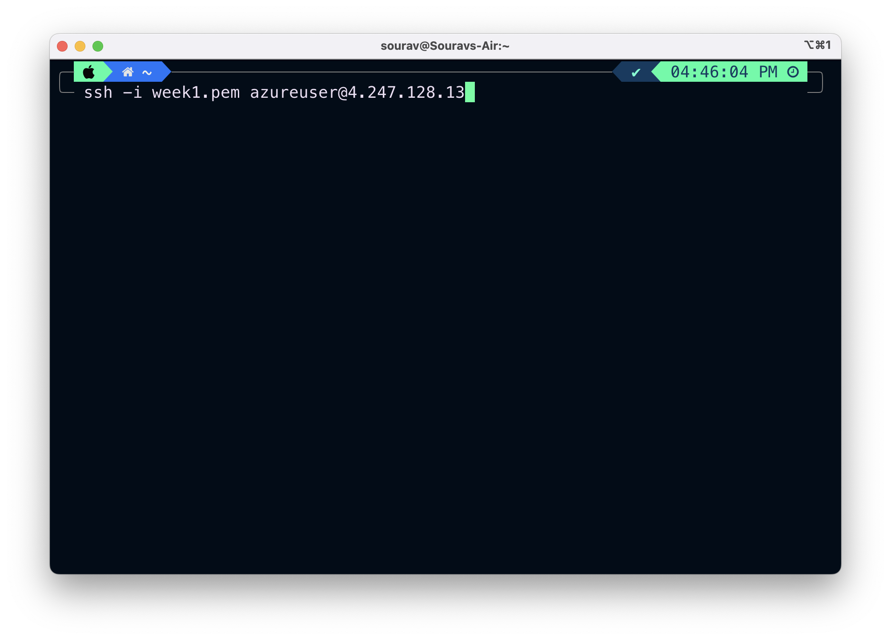

# Linux and Shell Scripting

## 1. Create free trial account on all 3 cloud providers - AWS, GCP, AZURE


## 2. Blog on Operating system, Architecture, OS Features

### 

## 3. Blog on Linux, Linux for DevOps

### 

## 4. Launch instance in cloud provider Azure, AWS, GCP

### AWS


### Azure


### GCP


## 5. Blog on VI editor - modes and shortcuts

### 

## 6. Blog on Linux filesystem and hierarchy

### 

## 7. Blog on SSH and SCP

### 

## 8. Connect remote machine/instance using SSH Azure, AWS, GCP

### AWS



### Azure



### GCP


## 9. Copy a local file to remote instance using SCP Azure, AWS, GCP

### AWS


### Azure


### GCP


## 10. Copy a file from remote machine to local machine Azure, AWS, GCP

### AWS


### Azure


### GCP


## 11. Copy a file from one instance to another remote instance Azure, AWS, GCP

### First Local system to GCP Server


### then from GCP to Azure


### then from Azure to AWS


## 12. Shell script to find the Linux Operating system
```
#!/bin/bash

os_name=$(uname -s)
os_release=$(uname -r)

echo "Operating System: $os_name"
echo "Kernel Release: $os_release"

```
## 13. Shell script to restart the system if instance has been up for 2 weeks
```
#!/bin/bash

uptime_seconds=$(cut -d. -f1 /proc/uptime)

#(2 weeks = 1209600 seconds)
max_uptime=1209600

if [ "$uptime_seconds" -gt "$max_uptime" ]; then
    echo "System has been up for more than 2 weeks. Restarting..."
    sudo reboot
else
    echo "System uptime is within acceptable range."
fi

```
## 14. Shell script to get total, free and available memory
```

total_memory=$(free -m | awk '/Mem:/ {print $2}')

free_memory=$(free -m | awk '/Mem:/ {print $4}')

available_memory=$(free -m | awk '/Mem:/ {print $7}')

echo "Total Memory: $total_memory MB"
echo "Free Memory: $free_memory MB"
echo "Available Memory: $available_memory MB"
```
## 15. Shell script to check if Disk usage is more than 75% then send an email report
```

```
## 16. Shell script and run it in background
## 17. Shell script to verify if password is expired or how many days left for password to get expired