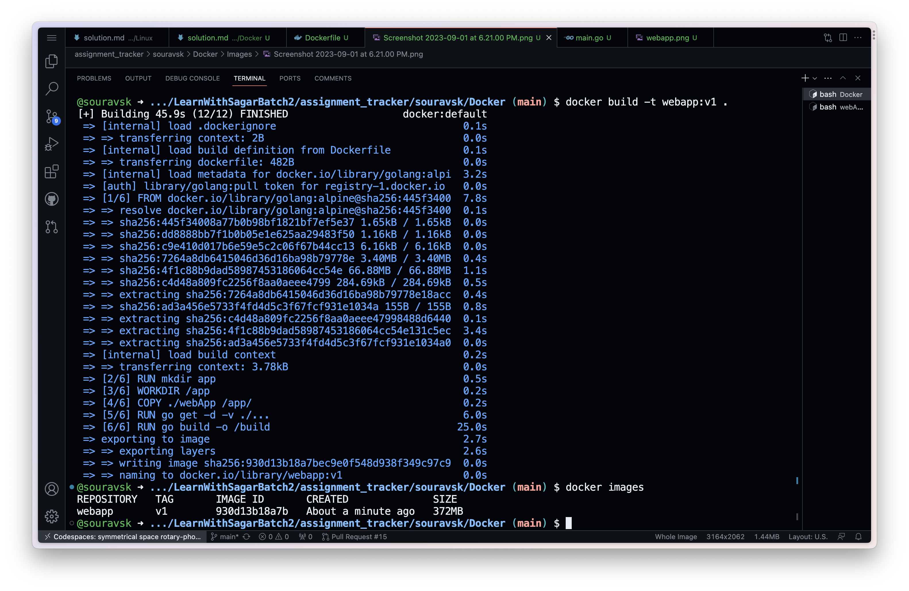

# Docker Assignments Solutions

## 1. Blog on Containerisation & Docker - why, what, how ?

### [What is Docker?](https://souravk.hashnode.dev/containers-and-docker-simplifying-application-deployment)

## 2. Blog Docker containers and images

### [Containerizing a go API with docker](https://souravk.hashnode.dev/containerizing-your-app)

## 3. Write Hello world webapp  in Python
 
 

## 4. Dockerise Hello World webapp




## 5. Push docker image to Docker Hub


## 6. Deploy nginx server and configure SSL

### Created ssl Key and certificate


## 7. REST API using Flask/Python + Golang
   ### a. Locally - Run mongoDB, set environment variable MONGODB_ENDPOINT, run your python application
   
   
   
   
   
   
   ### b. Docker :
       ```
         - create user defined bridge network - docker network create flaskmongo
         - run mongo container and use user defined bridge network ->>  docker run -itd -p 27017:27017 --name mongo --network flaskmongo -e MONGO_INITDB_DATABASE=example mongo:4.0.4
         - Build Docker image for flask container
         - Run flask container and use user defined bridge network ->> docker run -itd --name flaskrest --network flaskmongo -p 5060:5000 flaskrestapi\
         - Access your application on ->> http://localhost:5060/items

       ```
   
   

   ### c. Docker Compose -
       ```
       - To build only docker images ->> docker compose build
       - Start docker compose application ->>  docker compose up -d
       - Access your application on ->> http://localhost:5060/
       ```
   