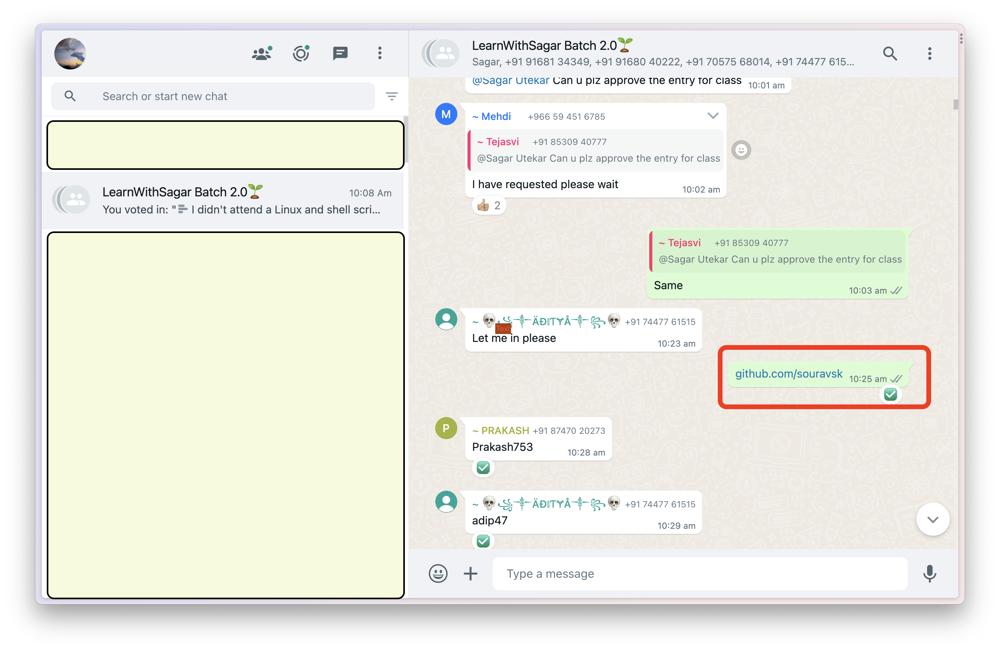
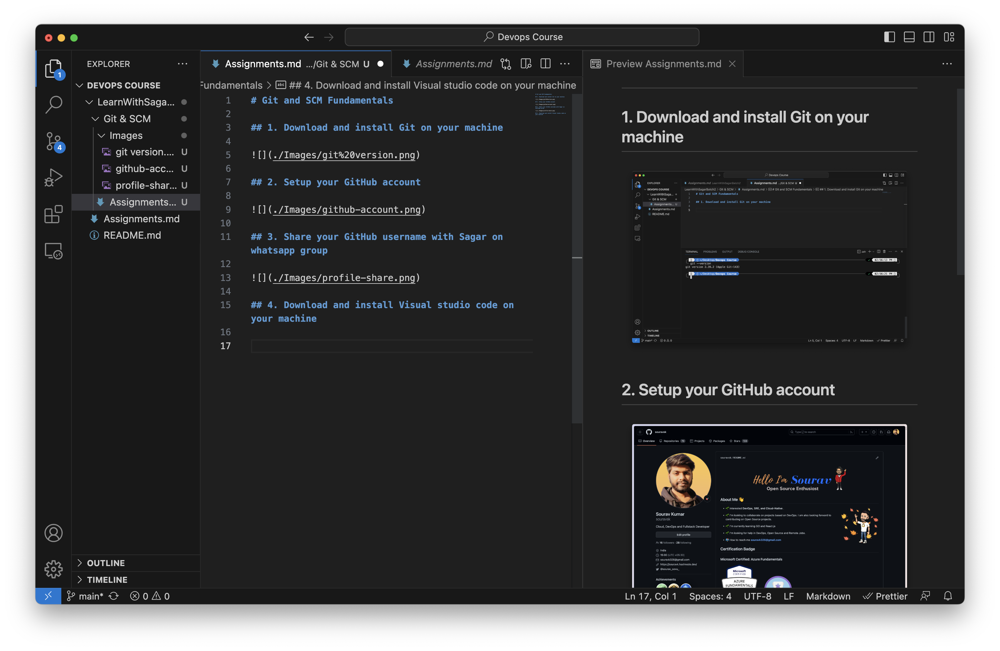

# Git and SCM Fundamentals

## 1. Download and install Git on your machine

## 2. Setup your GitHub account

## 3. Share your GitHub username with Sagar on whatsapp group

## 4. Download and install Visual studio code on your machine

## 5. Blog on Git and GitHub - What, Why and alternatives of GitHub

### 

## 6. Blog on Setting up a repository : git init, git clone and forking a repository

### 

## 7. Blog on Git basic commaSnds - Add, Commit, Push, config, branch, checkout

### 

## 8. Blog on Git Branches and commands

### 