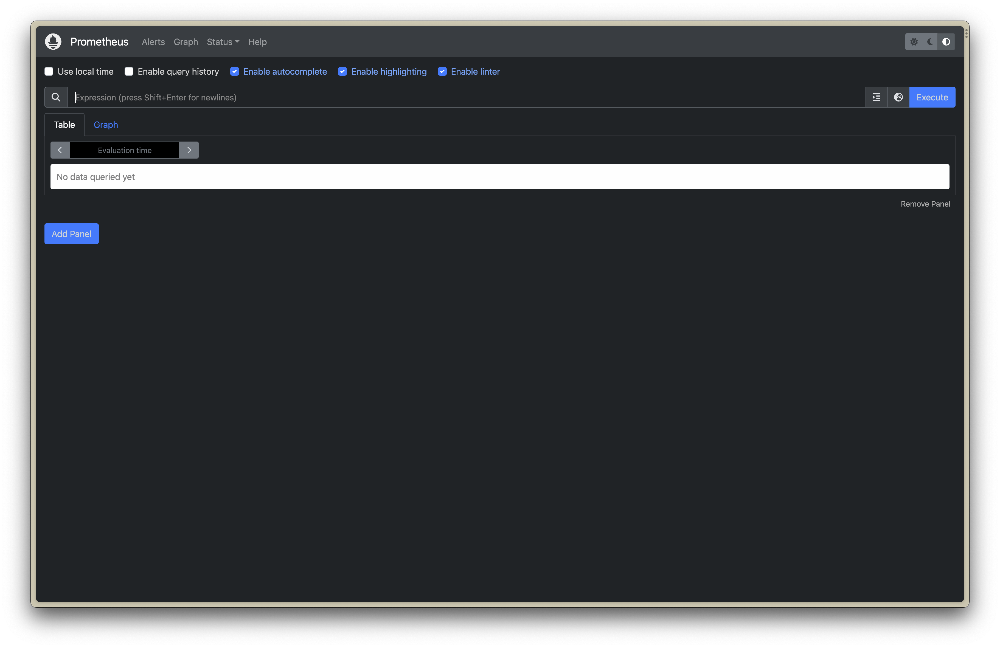

# Kubernetes

## 1. Blog on Kubernetes - Why, What, How

### [Kubernetes](https://souravk.hashnode.dev/kubernetes)

## 2. Blog on Minikube and set it up locally using Docker desktop container engine

### [Minikube for Kubernetes](https://souravk.hashnode.dev/minikube-for-kubernetes)

## 3. Blog on Pod - pod commands and also deploy sample application using pod

### [Kubernetes Pods For your Containers](https://souravk.hashnode.dev/pods)

## 4. Blog on Deployment, commands - why do we need it - deploy above pod application using deployment

### [How Deployment Works in Kubernetes](https://souravk.hashnode.dev/deployment)

## 5. Blog on Services, commands, types - why do we need it - create a nodeport service for above application and try to access it from your machine

### [Kubernetes Services and its type](https://souravk.hashnode.dev/kubernetes-services-and-its-type)

## 6. Blog on Namespaces - 

### [Organizing Your Kubernetes Cluster with Namespaces](https://souravk.hashnode.dev/k8s-ns)

## 7. Blog on Kubernetes Authentication - kubeconfig, how to access multiple kubernetes clusters, etc

### [What is a kubeconfig file?](https://souravk.hashnode.dev/kubeconfig)

## 8. Blog on Prometheus, features, architecture

###

## 9. Setup Prometheus on Linux machine (EC2) / I used GCP Cloud engine

### Download Prometheus and then extract the file and move to a folder.


**Step 1 :-** Create a Prometheus user, required directories, and make Prometheus the user as the owner of those directories.

```
sudo useradd --no-create-home --shell /bin/false prometheus
sudo mkdir /etc/prometheus
sudo mkdir /var/lib/prometheus
sudo chown prometheus:prometheus /etc/prometheus
sudo chown prometheus:prometheus /var/lib/prometheus
```
**Step 2:** Copy prometheus and promtool binary from prometheus-files folder to /usr/local/bin and change the ownership to prometheus user.
```
sudo cp prometheus-files/prometheus /usr/local/bin/
sudo cp prometheus-files/promtool /usr/local/bin/
sudo chown prometheus:prometheus /usr/local/bin/prometheus
sudo chown prometheus:prometheus /usr/local/bin/promtool
```
**Step 3:** Move the consoles and console_libraries directories from prometheus-files to /etc/prometheus folder and change the ownership to prometheus user.
```
sudo cp -r prometheus-files/consoles /etc/prometheus
sudo cp -r prometheus-files/console_libraries /etc/prometheus
sudo chown -R prometheus:prometheus /etc/prometheus/consoles
sudo chown -R prometheus:prometheus /etc/prometheus/console_libraries
```

### Setup Prometheus Configuration
All the prometheus configurations should be present in /etc/prometheus/prometheus.yml file.

**Step 1:** Create the prometheus.yml file.

```
sudo vi /etc/prometheus/prometheus.yml
```

**Step 2:** Copy the following contents to the prometheus.yml file.
```
global:
  scrape_interval: 10s

scrape_configs:
  - job_name: 'prometheus'
    scrape_interval: 5s
    static_configs:
      - targets: ['localhost:9090']
```

**Step 3:** Change the ownership of the file to prometheus user.
```
sudo chown prometheus:prometheus /etc/prometheus/prometheus.yml
```

### Setup Prometheus Service File

**Step 1:** Create a prometheus service file.
```bash
sudo vi /etc/systemd/system/prometheus.service
```

**Step 2:** Copy the following content to the file.
```sh
[Unit]
Description=Prometheus
Wants=network-online.target
After=network-online.target

[Service]
User=prometheus
Group=prometheus
Type=simple
ExecStart=/usr/local/bin/prometheus \
    --config.file /etc/prometheus/prometheus.yml \
    --storage.tsdb.path /var/lib/prometheus/ \
    --web.console.templates=/etc/prometheus/consoles \
    --web.console.libraries=/etc/prometheus/console_libraries

[Install]
WantedBy=multi-user.target
```

**Step 3:** Reload the systemd service to register the prometheus service and start the prometheus service.
```sh
sudo systemctl daemon-reload
sudo systemctl start prometheus
```
Check the prometheus service status using the following command.
```bash
sudo systemctl status prometheus
```


> Add the Port 9090 into you VM Ingress

```bash
http://<VM IP>:9090
```



## 10. Setup Grafana on Linux machine (EC2)

### install Grafana from the APT repository:

Install the prerequisite packages:

```bash
sudo apt-get install -y apt-transport-https software-properties-common wget
```
Import the GPG key:

```bash
sudo mkdir -p /etc/apt/keyrings/
wget -q -O - https://apt.grafana.com/gpg.key | gpg --dearmor | sudo tee /etc/apt/keyrings/grafana.gpg > /dev/null
```
To add a repository for stable releases, run the following command:

```bash
echo "deb [signed-by=/etc/apt/keyrings/grafana.gpg] https://apt.grafana.com stable main" | sudo tee -a /etc/apt/sources.list.d/grafana.list
```
To add a repository for beta releases, run the following command:

```bash
echo "deb [signed-by=/etc/apt/keyrings/grafana.gpg] https://apt.grafana.com beta main" | sudo tee -a /etc/apt/sources.list.d/grafana.list
```
Run the following command to update the list of available packages:

```bash
# Updates the list of available packages
sudo apt-get update
```
To install Grafana OSS, run the following command:

```bash
# Installs the latest OSS release:
sudo apt-get install grafana
```
To install Grafana Enterprise, run the following command:

```bash
# Installs the latest Enterprise release:
sudo apt-get install grafana-enterprise
```


> Add the Port 3000 into you VM Ingress

```bash
http://<vm IP>:3000
```


## 11. Monitor different Azure virtual machine from single Prometheus and grafana setup 

### This is how we are going to monitor azure VM


### Step 1 - Create an Azure VM.


### Step 2 - Now ssh to vm and install node exporter

```bash
ssh -i <key address> <username><vm IP>
```
Now copy the download address of Prometheus Node Exporter Binari and download into the Azure VM

```bash

cd /opt/

sudo wget https://github.com/prometheus/node_exporter/releases/download/v1.6.1/node_exporter-1.6.1.linux-amd64.tar.gz

```
Now extrate zip file and rename the file

```bash
sudo tar xf node_exporter-1.6.1.linux-amd64.tar.gz
sudo mv node_exporter-1.6.1.linux-amd64 node_exporter
```
Now cd into the folder and start the againt

```bash
cd node_exporter
sudo ./node_exporter
```


Add port 9100 in security group and then 
```
http://<vm ip>:9100
``` 

### Step 3 - Now Create a VM in GCP and install prometheus on that vm.

Created VM and install the Prometheus. After that we can have to configur the prometheus yaml file.

You can find the yaml file here
`/etc/prometheus`

IN the Targets secation we have added our Azure VM IP and Port so that it can get all the metric data from that IP.


After that restart the Prometheus 

```bash
sudo systemctl restart prometheus
```


Now to prometheus url and go to the target to see that your target has added on or not which is Azure VM


### Step 4 - Install Grafana

After installing grafana login to the dashbord


After that Click on Add Data Source then select Prometheus


In the Prometheus server URL write the Prometheus Server URL and save it.

```
http://<vmip>:9090
```

After that we will import Dashboard for that search for `Grafana labs Node Exporter Full` and copy the clipboard and put it here
and Press load


Then select Prometheus in the Prometheus section


Then press Import 


YES it's working.....

## 12. Blog on Grafana - features, usage, usacases

###

## 13. Blog on Kubernetes Secrets

### [Kubernetes Secrets](https://souravk.hashnode.dev/secret)

## 14. Blog on AKS - features

### [Azure Kubernetes Service (AKS)](https://souravk.hashnode.dev/aks)

## 15. Create managed Kubernetes cluster with multi node setup
      a. AKS
      b. EKS
      C. GKE

### AKS


### EKS

### GKS


## 17. Monitor Managed kubernetes service using single Prometheus Grafana setup

### 

## 18. Monitor Human Health using Strava on
   
### a. Minikube


### b. Managed Kubernetes Service


## 20. Setup FLASK MongoDB Application on Minikube and Managed Kubernetes Service


## 21 Kubernetes
       - Namespace
       - Mongo, flask POD using Deployment
       - Services for Mongo and Flask
       - MongoDB PV, PVC
       kubectl apply -f kubernetes/.
       kubernetes delete -f kubernetes/.
## Pod Autoscaling : KEDA, Kubespray
## Cluster Autoscaling
## Sealed secrets : https://github.com/bitnami-labs/sealed-secrets
## Installation of ArgoCD using Helm chart
## Depeloy your Application on EKS/GKE/AKS on one the cluster
## Create a separate environment to host your ArgoCD
## Interate GitHub + Helm Chart and ArgoCD
